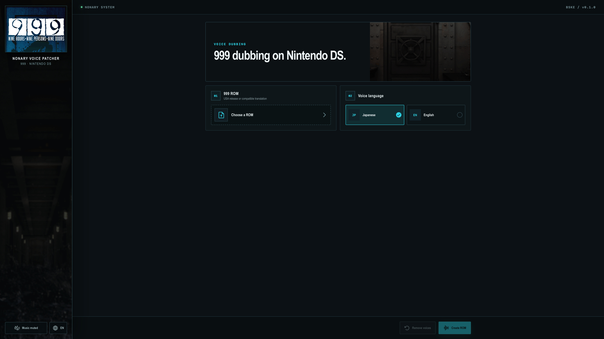

# Nonary Voice Patcher

Nonary Voice Patcher adds the Japanese or English dialogue voices from
*Zero Escape: The Nonary Games* to the US Nintendo DS release of
*999: Nine Hours, Nine Persons, Nine Doors*.

The project contains a Tauri desktop application, a headless Rust CLI, the ROM
patching engine, and the research scripts used to derive the voice mapping.
The current profile injects 6,414 voiced dialogue targets across 51 scripts.
Narration is excluded unless the DS script names the same speaking character,
which prevents Junpei's remake narration from playing over bottom-screen prose.



## What the patch changes

- Adds contiguous `sound/se_v0000.se` through `sound/se_v6413.se` resources.
- Injects `PlaySE`/`WaitSE` operations at reviewed `setText` ordinals.
- Extends `etc/sound.dat` with the generated voice symbols.
- Silences the ten system text-bleep volume operands that would otherwise play
  over spoken lines.
- Repairs 17 known pointer fields only when the input matches reviewed French
  translation fingerprints.
- Appends a restoration receipt so `reset` can reconstruct the input ROM
  byte-for-byte.

The engine validates script structure independently of text bytes. This allows
the stock US ROM and compatible translations to share one voice profile while
preventing voice calls from drifting when control flow has changed.

## What is not included

This repository does not distribute a ROM, save data, the PC game archive,
extracted voices, or generated voice packs. The production
`voices-jp.nvpack` and `voices-en.nvpack` files are generated outside the
repository from privately owned game inputs. The reviewed alignment decisions
needed to reproduce them are tracked under `research/reviews/`. See
[NOTICE.md](NOTICE.md).

## Required runtime files

The patcher consumes generated `.nvpack` files, not the PC installation, a ZIP
archive, or extracted audio files directly. Pack generation is documented in
[docs/HACK_PROCESS.md](docs/HACK_PROCESS.md). Generated packs use these exact
filenames:

```text
resources/
├── voice-profile.json
├── voices-jp.nvpack
└── voices-en.nvpack
```

`voice-profile.json` is included in the repository. The two voice packs are
private generated inputs excluded by `.gitignore`. They belong directly in
`resources/`, without ZIP compression or an additional nested directory.

The complete generation pipeline is documented in
[docs/HACK_PROCESS.md](docs/HACK_PROCESS.md). A fresh clone contains both
human-review ledgers and the final text-free runtime alignment, while the ROM,
`ze1_data.bin`, extracted files, and generated audio remain local inputs.

### Generating the voice packs

The repository contains everything needed except the two game files. A local
build uses:

```text
original/
├── 999-us.nds       # US BSKE ROM
└── ze1_data.bin     # The Nonary Games PC archive
```

The full guide lists the usual Steam and CrossOver source locations, reference
input hashes, pinned Python environment, and PowerShell command conventions.

Follow sections 1, 2, 6, and 9 of
[docs/HACK_PROCESS.md](docs/HACK_PROCESS.md) to:

1. extract the DS filesystem and audio template;
2. reconstruct the PC archive voice index;
3. generate the 6,414 Japanese and English DS voice resources from the tracked
   `research/alignment/final_voice_alignment.tsv` map;
4. package them as `voices-jp.nvpack` and `voices-en.nvpack`.

The bundled `voice-profile.json` is already versioned and does not need to be
generated. Its optional exact-regeneration procedure uses the tracked,
text-free compatibility manifest and is documented in section 9 of the same
guide.

| Operation | Required files |
| --- | --- |
| Inspect a ROM | `voice-profile.json` |
| Apply Japanese voices | `voice-profile.json` and `voices-jp.nvpack` |
| Apply English voices | `voice-profile.json` and `voices-en.nvpack` |
| Reset a ROM patched by this tool | No runtime resources |

Install both packs for the complete desktop experience because the GUI exposes
both voice-language choices.

## Desktop GUI setup

### Running from source

Copy the generated packs into the project resource directory before starting
or building the Tauri application:

```text
nonary-voice-patcher/
└── src-tauri/
    └── resources/
        ├── voice-profile.json
        ├── voices-jp.nvpack
        └── voices-en.nvpack
```

```sh
npm ci
npm run tauri dev
```

`npm run tauri build` copies that directory into the application bundle. The
packs must therefore be present before the build begins.

### Using an installed or unpacked GUI

The v0.1.0 macOS DMG and Windows installer are self-contained: they already
include the profile and both voice packs. End users only provide a compatible
`.nds` ROM; they do not need a Steam installation, `ze1_data.bin`, extracted
audio, Python, or the research scripts. Only pack regeneration uses those
inputs.

For a local pack-free build, close the application and place the packs in its
runtime `resources` directory:

| Platform | Resource directory |
| --- | --- |
| Windows | `<installation directory>\resources\` |
| Windows installer default | `%LOCALAPPDATA%\Nonary Voice Patcher\resources\` |
| macOS | `Nonary Voice Patcher.app/Contents/Resources/resources/` |

On macOS, first copy the application out of the read-only DMG. In Finder,
right-click **Nonary Voice Patcher.app**, select **Show Package Contents**, and
open `Contents/Resources/resources/`. A signed or notarized application must
instead be rebuilt with the packs before signing, because modifying its bundle
invalidates the signature.

Restart the application after adding the files.

### Applying the patch

1. Keep the ROM outside the resource directory; it may be stored anywhere you
   can read and write files.
2. Start the application and choose the interface language.
3. Select the US `BSKE` ROM or a compatible translation.
4. Choose Japanese or English voices.
5. Select **Create ROM** and choose a separate output `.nds` path.

The source ROM is not overwritten. For the reviewed French translation, apply
the French patch to a clean US ROM first, then use the resulting translated ROM
as the input here. Applying the tools in the opposite order is unsupported; see
[docs/COMPATIBILITY.md](docs/COMPATIBILITY.md).

Select an already patched ROM and use **Remove voices** to create an exact
restoration of the ROM that was originally supplied to the patcher.

## Command-line interface

The headless CLI exposes the same patching engine as the desktop application
without requiring Node.js, Tauri, or a webview. It is a separate executable:
`nonary-voice-patcher` is the desktop program and cannot be used as the CLI.

### CLI-only prerequisites

Install the current stable [Rust toolchain with
`rustup`](https://www.rust-lang.org/tools/install/) and a native C/C++ build
toolchain. The native toolchain is required because one of the Rust
dependencies compiles bundled C code.

| Platform | Required native tools |
| --- | --- |
| macOS | Xcode Command Line Tools: `xcode-select --install` |
| Debian/Ubuntu | `sudo apt update && sudo apt install build-essential pkg-config curl git` |
| Other Linux distributions | The equivalent C compiler, linker, `pkg-config`, `curl`, and Git packages |
| Windows | [Git for Windows](https://git-scm.com/download/win), plus Visual Studio 2022 Build Tools with **Desktop development with C++** and a Windows 10 or 11 SDK; see Microsoft's [Rust setup guide](https://learn.microsoft.com/windows/dev-environment/rust/setup) |

On macOS or Linux, install `rustup` with the command published by the Rust
project:

```sh
curl --proto '=https' --tlsv1.2 -sSf https://sh.rustup.rs | sh
```

On Windows, download and run `rustup-init.exe` from the Rust installation page
linked above and accept the default MSVC toolchain. Open a new terminal if the
installer requests it, then verify the toolchain:

```sh
rustup toolchain install stable
rustup default stable
rustup component add rustfmt clippy
cargo --version
rustc --version
```

The `rustfmt` and `clippy` components are needed only for the optional
validation commands below. On Windows, use the default
`x86_64-pc-windows-msvc` toolchain. Node.js, npm, Python, Tauri, WebView2, and
WebKitGTK are not required for a CLI-only build. The voice packs are runtime
data and are not required to compile the binary.

### Clone and compile

Run the following commands from a terminal. If the repository is already
checked out, start with the `cd` command and replace the path as appropriate.

```sh
git clone https://github.com/samsungapore/nonary-voice-patcher.git
cd nonary-voice-patcher

cargo build \
  --manifest-path src-tauri/Cargo.toml \
  --release \
  --locked \
  --no-default-features \
  --features cli \
  --bin nonary-voice-patcher-cli
```

The equivalent PowerShell build command is:

```powershell
cargo build `
  --manifest-path .\src-tauri\Cargo.toml `
  --release `
  --locked `
  --no-default-features `
  --features cli `
  --bin nonary-voice-patcher-cli
```

The release executable is written here:

| Platform | Output |
| --- | --- |
| macOS/Linux | `src-tauri/target/release/nonary-voice-patcher-cli` |
| Windows | `src-tauri\target\release\nonary-voice-patcher-cli.exe` |

If `--target <TRIPLE>` is added for an explicitly installed Rust target, the
binary is instead under `src-tauri/target/<TRIPLE>/release/`. Native builds on
the intended operating system are recommended. `--locked` uses the committed
Cargo lockfile for dependency reproducibility; the repository does not pin an
exact Rust compiler version.

Verify the executable:

```sh
src-tauri/target/release/nonary-voice-patcher-cli --version
src-tauri/target/release/nonary-voice-patcher-cli --help
```

PowerShell:

```powershell
& .\src-tauri\target\release\nonary-voice-patcher-cli.exe --version
& .\src-tauri\target\release\nonary-voice-patcher-cli.exe --help
```

These checks do not require either voice pack:

```sh
cargo fmt --manifest-path src-tauri/Cargo.toml --all -- --check
cargo clippy \
  --manifest-path src-tauri/Cargo.toml \
  --locked \
  --no-default-features \
  --features cli \
  --all-targets -- -D warnings
cargo test \
  --manifest-path src-tauri/Cargo.toml \
  --locked \
  --no-default-features \
  --features cli \
  --all-targets
```

Tests that require private ROM or audio fixtures are marked as ignored.

### Prepare runtime resources

Cargo compiles only the program; it does not create or embed voice packs.
`apply` requires a generated `voices-jp.nvpack` or `voices-en.nvpack`. The
tracked 6,414-target runtime alignment makes both packs reproducible when
combined with the private game inputs listed in
[docs/HACK_PROCESS.md](docs/HACK_PROCESS.md).

The CLI does not read a Steam installation, `ze1_data.bin`, a ZIP archive, or
loose audio files directly. If no generated pack is available, `inspect` and
`reset` can still be used according to the resource table below, but `apply`
cannot add voices.

The portable layout is:

```text
portable-patcher/
├── nonary-voice-patcher-cli        # .exe on Windows
└── resources/
    ├── voice-profile.json
    ├── voices-jp.nvpack
    └── voices-en.nvpack
```

Copy `voice-profile.json` from `src-tauri/resources/`. Copy each generated pack
directly into the same `resources/` directory; do not leave a pack zipped or
create `resources/resources/`. Only install the language pack that you intend
to apply, or install both to support both languages.

Example on macOS or Linux, from the repository root:

```sh
mkdir -p portable-patcher/resources
cp src-tauri/target/release/nonary-voice-patcher-cli portable-patcher/
cp src-tauri/resources/voice-profile.json portable-patcher/resources/
# Copy either or both generated packs:
cp "/absolute/path/to/voices-jp.nvpack" portable-patcher/resources/
cp "/absolute/path/to/voices-en.nvpack" portable-patcher/resources/
```

Example in Windows PowerShell:

```powershell
New-Item -ItemType Directory -Force .\portable-patcher\resources | Out-Null
Copy-Item .\src-tauri\target\release\nonary-voice-patcher-cli.exe `
  .\portable-patcher\
Copy-Item .\src-tauri\resources\voice-profile.json `
  .\portable-patcher\resources\
# Copy either or both generated packs:
Copy-Item "C:\path\to\voices-jp.nvpack" .\portable-patcher\resources\
Copy-Item "C:\path\to\voices-en.nvpack" .\portable-patcher\resources\
```

The resource requirements are:

| Command | Required runtime files |
| --- | --- |
| `inspect` | `voice-profile.json` |
| `apply --language jp` | `voice-profile.json` and `voices-jp.nvpack` |
| `apply --language en` | `voice-profile.json` and `voices-en.nvpack` |
| `reset` | None |

Private packs and ROMs are not repository content. `.gitignore` excludes the
standard pack filenames.

### Syntax and options

```text
nonary-voice-patcher-cli [OPTIONS] <COMMAND>

Commands:
  inspect <INPUT_ROM>
  apply <INPUT_ROM> <OUTPUT_ROM> --language <jp|en>
  reset <PATCHED_ROM> <OUTPUT_ROM>
  help [COMMAND]

Options:
      --json
      --resources-dir <DIR>
  -h, --help
  -V, --version
```

Global options may appear before or after a subcommand. `--language` is
required by `apply` and accepts only `jp` or `en`. Quote every path that can
contain spaces. There is no `--force` or `--quiet` option.

### Inspect a ROM

Always inspect a ROM before patching it:

```sh
./portable-patcher/nonary-voice-patcher-cli \
  --resources-dir "/absolute/path/to/portable-patcher/resources" \
  inspect "/absolute/path/to/source.nds"
```

PowerShell:

```powershell
& .\portable-patcher\nonary-voice-patcher-cli.exe `
  --resources-dir "C:\absolute\path\to\portable-patcher\resources" `
  inspect "C:\roms\source.nds"
```

`inspect` reports the ROM title, game code, size, SHA-256, state,
compatibility, and an explanatory detail. Interpret the state as follows:

| State | Meaning and next action |
| --- | --- |
| `clean` | Continue only when `Compatible: yes`. |
| `japanese` | The ROM already has this tool's Japanese patch; reset it, or switch languages with `apply` only when `Compatible: yes`. |
| `english` | The ROM already has this tool's English patch; reset it, or switch languages with `apply` only when `Compatible: yes`. |
| `legacy_voice_patch` | The ROM has an older non-reversible patch; return to a clean or pre-voice ROM. |
| `unsupported` | Stop and use a supported ROM; see [docs/COMPATIBILITY.md](docs/COMPATIBILITY.md). |

`inspect` can exit with code `0` while reporting `Compatible: no`. Scripts must
check the reported compatibility rather than using the process exit code alone.

### Apply Japanese or English voices

The commands below create new output ROMs:

```sh
./portable-patcher/nonary-voice-patcher-cli \
  --resources-dir "/absolute/path/to/portable-patcher/resources" \
  apply "/absolute/path/to/source.nds" \
  "/absolute/path/to/999-voiced-jp.nds" --language jp

./portable-patcher/nonary-voice-patcher-cli \
  --resources-dir "/absolute/path/to/portable-patcher/resources" \
  apply "/absolute/path/to/source.nds" \
  "/absolute/path/to/999-voiced-en.nds" --language en
```

PowerShell:

```powershell
& .\portable-patcher\nonary-voice-patcher-cli.exe `
  --resources-dir "C:\absolute\path\to\portable-patcher\resources" `
  apply "C:\roms\source.nds" "C:\roms\999-voiced-jp.nds" --language jp

& .\portable-patcher\nonary-voice-patcher-cli.exe `
  --resources-dir "C:\absolute\path\to\portable-patcher\resources" `
  apply "C:\roms\source.nds" "C:\roms\999-voiced-en.nds" --language en
```

The input and output must resolve to different paths, including through
symbolic links. Missing output directories are created. The input is not
modified: the engine writes a temporary file and publishes the output only
after verification. A distinct existing output file can be replaced, so use a
new output filename when retaining an earlier result matters.

Applying Japanese voices to an English-patched ROM, or the reverse, first
restores the base recorded in the patch receipt and then applies the selected
language. Voice patches therefore do not stack. A legacy patch without a valid
receipt is rejected.

For the reviewed French translation, the supported order is:

1. Start with a clean US ROM.
2. Apply the French translation patch.
3. Pass the translated ROM to this CLI.

Applying the voice patch before the French translation is unsupported.

### Verify and use the output

Inspect the newly created ROM and require the expected `japanese` or `english`
state:

```sh
./portable-patcher/nonary-voice-patcher-cli \
  --resources-dir "/absolute/path/to/portable-patcher/resources" \
  inspect "/absolute/path/to/999-voiced-jp.nds"
```

Record the reported SHA-256 if the output is being transferred to another
device. Load the new output ROM, not the original input, in the emulator or on
compatible hardware.

### Remove voices and restore the input ROM

`reset` accepts only a ROM with an intact restoration receipt produced by this
patcher. It reconstructs the exact ROM passed to `apply`, including a compatible
translation if one was present:

```sh
./portable-patcher/nonary-voice-patcher-cli \
  reset "/absolute/path/to/999-voiced-jp.nds" \
  "/absolute/path/to/999-restored.nds"
```

PowerShell:

```powershell
& .\portable-patcher\nonary-voice-patcher-cli.exe `
  reset "C:\roms\999-voiced-jp.nds" "C:\roms\999-restored.nds"
```

`reset` needs no profile or voice pack, so `--resources-dir` is unnecessary.
Its input and output must still be different paths.

### Resource discovery

Passing an absolute `--resources-dir` is recommended for scripts and always
takes precedence. If that explicit directory is invalid, the CLI reports an
error instead of silently trying another location.

Without the option, the CLI selects the first directory containing
`voice-profile.json` in this order:

1. `NONARY_VOICE_PATCHER_RESOURCES`;
2. `resources/` beside the executable;
3. the executable directory itself;
4. `<executable-parent>/Resources/resources`;
5. `<executable-parent>/Resources`;
6. `$APPDIR/usr/lib/nonary-voice-patcher/resources` in a Linux AppImage;
7. `/usr/lib/nonary-voice-patcher/resources` on Linux;
8. `<executable-dir>/../share/nonary-voice-patcher/resources`;
9. the absolute development `src-tauri/resources` path recorded when the
   binary was compiled.

The compile-time development path is not portable. Discovery stops at the first
directory containing a profile; a missing language pack in that directory
produces a resource error.

The environment variable can be used for an interactive shell:

```sh
export NONARY_VOICE_PATCHER_RESOURCES="/absolute/path/to/resources"
./portable-patcher/nonary-voice-patcher-cli inspect "/path/to/source.nds"
```

PowerShell:

```powershell
$env:NONARY_VOICE_PATCHER_RESOURCES = "C:\absolute\path\to\resources"
& .\portable-patcher\nonary-voice-patcher-cli.exe inspect "C:\roms\source.nds"
```

### JSON automation

Add `--json` when another program will consume the result:

```sh
./portable-patcher/nonary-voice-patcher-cli \
  --json \
  --resources-dir "/absolute/path/to/portable-patcher/resources" \
  inspect "/path/to/source.nds" >result.json 2>progress.jsonl
```

The machine-readable contract is:

- stdout contains exactly one compact result or error JSON object;
- stderr contains zero or more newline-delimited JSON progress objects;
- `--help` and `--version` remain terminal text;
- stdout and stderr must be read concurrently when using pipes;
- success requires process exit code `0`, `ok: true`, and
  `schemaVersion: 1`;
- successful inspection also requires `result.compatible: true` before
  patching;
- `--language` accepts `jp` or `en`, while an apply result reports
  `"language":"japanese"` or `"language":"english"`;
- reset reports `"language":null`, zero voices and scripts, and
  `"resetExact":true`.

Current progress stages include `inspect`, `read`, `scripts`, `write`,
`verify`, and `done`. Treat the process exit code and final stdout envelope as
authoritative; a progress event never proves completion. See
[docs/CLI.md](docs/CLI.md) for the complete JSON schemas and examples.

### Exit codes

| Code | JSON error code | Meaning |
| ---: | --- | --- |
| `0` | — | Success, help, or version; `inspect` may still report an incompatible ROM |
| `2` | `usage_error` | Invalid command syntax, option, or language |
| `3` | `resource_error` | Missing or invalid profile/pack, wrong pack language, invalid payload size, or profile/ROM compatibility failure during `apply` |
| `4` | `input_error` | Invalid NDS/receipt, legacy patch, same input/output path, or 512 MiB ROM limit |
| `5` | `io_error` | File, directory, permission, or other filesystem failure |
| `6` | `operation_error` | FSB, audio-registry, text-bleep, patch, or final-verification failure |
| `70` | `internal_error` | JSON result serialization failure |

### Common CLI problems

| Symptom | Resolution |
| --- | --- |
| `cargo: command not found` | Open a new terminal after installing Rust, then rerun `cargo --version`. |
| Linker or C compiler failure | Install the native build tools listed under CLI-only prerequisites. |
| Resource directory/profile not found | Pass an absolute `--resources-dir` containing `voice-profile.json`. |
| Selected voice pack not found | Put the exact `voices-jp.nvpack` or `voices-en.nvpack` filename beside the profile. |
| `Compatible: no` or `unsupported` | Stop and check [docs/COMPATIBILITY.md](docs/COMPATIBILITY.md). |
| `legacy_voice_patch` | Return to a clean or pre-voice ROM; a legacy patch cannot be reset safely. |
| Input and output are the same | Choose a distinct output filename and avoid aliases or symlinks to the input. |
| Reset reports no valid patch receipt | Reset only an unmodified ROM created by this patcher's `apply` command. |

For additional diagnostics, see
[docs/TROUBLESHOOTING.md](docs/TROUBLESHOOTING.md).

## Full project development

Requirements:

- Node.js 20.19 or newer and npm;
- a stable Rust toolchain;
- Python 3.11 or newer for research scripts;
- the platform prerequisites for Tauri 2.

```sh
npm ci
npm run build
cargo test --manifest-path src-tauri/Cargo.toml \
  --locked --no-default-features --features cli --all-targets
python3 -m venv .venv
. .venv/bin/activate
python -m pip install -r requirements-dev.txt
python -m unittest discover -s tests -v
```

Run the desktop application with `npm run tauri dev`. Building a functional
application bundle additionally requires the two private voice packs in
`src-tauri/resources/`. See [docs/BUILDING.md](docs/BUILDING.md).

## Repository map

```text
src/                    React desktop interface
src-tauri/src/          Rust engine, Tauri commands, and CLI
src-tauri/resources/    Public profile plus private local voice packs
scripts/                Reproducible research and build utilities
research/alignment/     Text-free production map used to build voice packs
research/compatibility/ Text-free source data used to rebuild the profile
research/reviews/       Human-review decisions behind the production map
tests/                  Synthetic Python tests
docs/                   Technical and operational documentation
```

## Documentation

- [How the hack was built](docs/HACK_PROCESS.md)
- [Dialogue alignment and the rejected candidates](docs/ALIGNMENT.md)
- [Runtime architecture and safety invariants](docs/ARCHITECTURE.md)
- [CLI reference and JSON contract](docs/CLI.md)
- [Binary formats](docs/FORMATS.md)
- [ROM and translation compatibility](docs/COMPATIBILITY.md)
- [Building from source](docs/BUILDING.md)
- [Testing and emulator validation](docs/TESTING.md)
- [Release procedure](docs/RELEASING.md)
- [Troubleshooting](docs/TROUBLESHOOTING.md)

## License

Original code and textual documentation are available under the
[MIT License](LICENSE). Game-derived assets and screenshots are outside that
license. See [NOTICE.md](NOTICE.md) and
[THIRD_PARTY_NOTICES.md](THIRD_PARTY_NOTICES.md).
