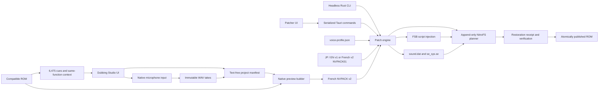

# Architecture

The patcher UI and headless CLI are adapters around the same Rust ROM engine.
The desktop application additionally hosts project, recording, playback, and
French-build modules; its completed preview ROM still passes through that same
engine. The engine accepts file paths and explicit resources, produces progress
events, and returns serializable inspection or patch results.

## Components

### Frontend

`src/App.tsx` switches between the patcher and the Dubbing Studio. The patcher
owns language selection, ROM inspection, voice choice, progress, result
display, and reset. `src/features/dubbing/` owns project navigation, cue
filtering, context display, recording controls, take playback, review state,
and preview-build progress. Neither frontend parses or mutates ROM bytes.
Tauri dialog plugins choose paths; the backend remains the authority for path
identity, project integrity, and compatibility.

### Tauri command layer

`src-tauri/src/commands.rs` exposes capabilities, inspection, apply, reset,
project operations, native recording, take reads, and preview test-ROM builds.
A process-wide single-operation guard rejects overlapping ROM mutations.
Project mutations share a separate lock so a recording commit, take selection,
metadata update, or build cannot observe a partially updated manifest. Both
native and Python builders retain the cross-process project lock from snapshot
validation through atomic publication; this prevents a finished pack, report,
or test ROM from silently representing an older manifest state.

### CLI

`src-tauri/src/bin/nonary-voice-patcher-cli.rs` uses the same engine with no
Tauri dependency when built with `--no-default-features --features cli`.
Machine output separates the single result object on stdout from JSONL progress
on stderr so an embedding process can consume both without corrupting either
stream.

### Compatibility profile

`voice-profile.json` stores:

- game code `BSKE`;
- the required contiguous voice count;
- per-script structural fingerprints and `setText` ordinals;
- optional exact raw-text SHA-256 conditions for translation-specific targets;
- alternative reviewed fingerprints for compatible translations;
- exact, hash-pinned pointer repairs for five French-patched files.

Structural hashes exclude replaceable text bytes but include control flow,
operation order, and relocation-relevant structure. A translation can therefore
change prose without moving a voice target. Unknown structure is rejected.

### FSB and system resources

The FSB parser validates SIR0 pointers and relocation tables, repairs only the
known class of invalid relocated French pointers, injects voice operations, and
reparses the result. The engine compares every `setText` payload before and
after injection.

For a translation-specific target, the parser hashes the exact raw `setText`
payload before injection. A listed SHA-256 enables that voice; a mismatch
leaves the line untouched without weakening structural compatibility checks.

`sound_registry.rs` appends the `SE_V####` symbols while rebuilding categories
and relocations. `se_sys.rs` recognizes the complete expected routing graph and
zeros only ten volume operands. Both modules reject unfamiliar layouts.

### Voice packs

`voicepack.rs` accepts the original v1 format used by Japanese and English
packs and the catalogue-bound v2 format used by French projects. Both validate
a bounded entry table, per-entry SHA-256 values, and an aggregate payload hash.
V2 additionally authenticates the ordered `(symbol, script path, ordinal)`
catalogue so recordings cannot drift onto a reordered profile. Entries are
streamed into the ROM one at a time, so the pack reader never preloads or
duplicates the complete pack.

### Dubbing projects and recording

`dubbing/project.rs` creates a text-free `project.nvdub.json` manifest bound to
the logical base-ROM hash and target-catalogue digest; it also records the raw
profile hash for provenance. Dialogue and up to two neighboring lines on either
side are decoded from the selected ROM at open time and constrained to the same
script function. The manifest stores only stable target IDs, workflow state,
notes, processing settings, and take metadata.

`dubbing/recording.rs` captures the selected native input through CPAL,
downmixes it to mono, and writes 16-bit PCM WAV masters. Committed take names are
reserved without replacement. Each manifest entry records the WAV SHA-256 and
audio dimensions; approval adds a second digest that binds the active take,
gain, and trim values.

### French preview builder

`dubbing/build.rs` authenticates the project and active WAV masters, converts
them to 16,384 Hz mono, encodes DS IMA ADPCM `.se` resources, and writes a
catalogue-bound French v2 pack. Preview fills missing cues with 80 ms silence,
then applies the pack through the normal reversible engine. The generated pack
is `builds/voices-fr-preview.nvpack`; the native path does not write a JSON
sidecar. The standalone Python builder mirrors preview and strict production
exports for automation.

### Append-only NitroFS planner

Original file payloads remain in place while replacement scripts and system
files are appended and their FAT entries are redirected. Voice files are added
at the end of the `sound` directory's contiguous ID range, so later file IDs
shift consistently in the regenerated FNT/FAT. A few original-range metadata
bytes are rewritten and retained as receipt preimages for exact reset.

Overlay tables contain raw FAT IDs outside NitroFS. The planner refuses an
input whose overlay IDs would cross the insertion point because silently
shifting them would require an executable-format rewrite outside this patch's
safety model.

The new FNT and FAT are appended after payloads. Header offsets, device
capacity, RSA-signature pointer, auxiliary pointer, and header CRC16 are the
only original-range metadata updated.

### Restoration receipt

The receipt records the original length, SHA-256, first 0x200 header bytes,
four bytes at offset 0x1000, game code, and voice language. Those two byte
ranges are stored because they are the only original-prefix regions rewritten
by the append-only patch.

Reset truncates to the recorded length, restores both preimages, and accepts the
result only when its SHA-256 equals the stored original digest. A marker before
the DS signature pointer lets inspection locate the receipt without scanning
arbitrary ROM data.

## Apply sequence

1. Resolve path aliases and reject identical input/output files.
2. If the input is already patched, restore its verified base in memory.
3. Parse the NDS header, FNT, FAT, overlays, and source CRC.
4. Validate profile structure and any exact repair fingerprints.
5. Validate the requested voice pack and voice count.
6. Build script, registry, and text-bleep replacements in memory.
7. Plan every new file ID, offset, table, and final ROM size.
8. Stream the copied prefix and appended payloads to a temporary file.
9. Append receipt, marker, and retained signature bytes; update header metadata.
10. Restore the temporary file and compare it byte-for-byte with the base.
11. Reparse final metadata, fsync, then atomically persist the destination.

## Safety invariants

| Invariant | Enforcement |
| --- | --- |
| Source and destination differ | Resolved absolute-path comparison |
| Unknown ROM structure is not patched | Game code, FSB structure, profile hashes |
| Existing text remains exact | Pre/post `setText` byte comparison |
| Voice symbols and files are contiguous | Profile, pack, FNT, and FAT validation |
| Resource payloads are authentic | Entry and aggregate SHA-256 checks |
| French entries target the intended cues | V2 catalogue digest checked against the profile |
| Recorded masters remain attributable | WAV SHA-256 and metadata validation |
| Approval survives only its reviewed settings | Take/gain/trim approval digest |
| Existing file IDs remain coherent | Explicit old-to-new map and overlay gate |
| Interrupted work is not published | Same-directory temporary file + atomic persist |
| Reset is exact | Stored preimages + full original SHA-256 |
| ROM stays hardware-addressable | u32 offsets and 512 MiB DS limit |
