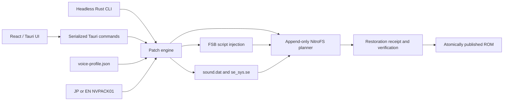

# Architecture

The desktop application and CLI are thin adapters around the same Rust engine.
The engine accepts file paths and explicit resources, produces progress events,
and returns serializable inspection or patch results.

## Components

### Frontend

`src/App.tsx` owns language selection, ROM inspection, voice choice, progress,
result display, and reset. It does not parse or mutate ROM bytes. Tauri dialog
plugins choose input/output paths; the backend remains the authority for path
identity and compatibility.

### Tauri command layer

`src-tauri/src/commands.rs` exposes capabilities, inspection, apply, and reset.
A process-wide single-operation guard rejects overlapping mutations because
simultaneous jobs could target the same output path and make progress events
ambiguous. It fails fast instead of queueing work behind the active job.

### CLI

`src-tauri/src/bin/nonary-voice-patcher-cli.rs` uses the same engine with no
Tauri dependency when built with `--no-default-features --features cli`.
Machine output separates the single result object on stdout from JSONL progress
on stderr so an embedding process can consume both without corrupting either
stream.

### Compatibility profile

`voice-profile.json` stores:

- game code `BSKE`;
- the required contiguous voice count;
- per-script structural fingerprints and `setText` ordinals;
- alternative reviewed fingerprints for compatible translations;
- exact, hash-pinned pointer repairs for five French-patched files.

Structural hashes exclude replaceable text bytes but include control flow,
operation order, and relocation-relevant structure. A translation can therefore
change prose without moving a voice target. Unknown structure is rejected.

### FSB and system resources

The FSB parser validates SIR0 pointers and relocation tables, repairs only the
known class of invalid relocated French pointers, injects voice operations, and
reparses the result. The engine compares every `setText` payload before and
after injection.

`sound_registry.rs` appends the `SE_V####` symbols while rebuilding categories
and relocations. `se_sys.rs` recognizes the complete expected routing graph and
zeros only ten volume operands. Both modules reject unfamiliar layouts.

### Voice packs

`voicepack.rs` validates a small fixed header, bounded entry table, per-entry
SHA-256 values, and aggregate payload hash. Entries are streamed into the ROM
one at a time, so the pack reader never preloads or duplicates a 140–175 MiB
pack. Final ROM metadata validation still materializes the FAT-addressable
image prefix required by the NDS parser.

### Append-only NitroFS planner

Original file payloads remain in place while replacement scripts and system
files are appended and their FAT entries are redirected. Voice files are added
at the end of the `sound` directory's contiguous ID range, so later file IDs
shift consistently in the regenerated FNT/FAT. A few original-range metadata
bytes are rewritten and retained as receipt preimages for exact reset.

Overlay tables contain raw FAT IDs outside NitroFS. The planner refuses an
input whose overlay IDs would cross the insertion point because silently
shifting them would require an executable-format rewrite outside this patch's
safety model.

The new FNT and FAT are appended after payloads. Header offsets, device
capacity, RSA-signature pointer, auxiliary pointer, and header CRC16 are the
only original-range metadata updated.

### Restoration receipt

The receipt records the original length, SHA-256, first 0x200 header bytes,
four bytes at offset 0x1000, game code, and voice language. Those two byte
ranges are stored because they are the only original-prefix regions rewritten
by the append-only patch.

Reset truncates to the recorded length, restores both preimages, and accepts the
result only when its SHA-256 equals the stored original digest. A marker before
the DS signature pointer lets inspection locate the receipt without scanning
arbitrary ROM data.

## Apply sequence

1. Canonicalize paths and reject identical input/output files.
2. If the input is already patched, restore its verified base in memory.
3. Parse the NDS header, FNT, FAT, overlays, and source CRC.
4. Validate profile structure and any exact repair fingerprints.
5. Validate the requested voice pack and voice count.
6. Build script, registry, and text-bleep replacements in memory.
7. Plan every new file ID, offset, table, and final ROM size.
8. Stream the copied prefix and appended payloads to a temporary file.
9. Append receipt, marker, and retained signature bytes; update header metadata.
10. Restore the temporary file and compare it byte-for-byte with the base.
11. Reparse final metadata, fsync, then atomically persist the destination.

## Safety invariants

| Invariant | Enforcement |
| --- | --- |
| Source and destination differ | Canonical path comparison |
| Unknown ROM structure is not patched | Game code, FSB structure, profile hashes |
| Existing text remains exact | Pre/post `setText` byte comparison |
| Voice symbols and files are contiguous | Profile, pack, FNT, and FAT validation |
| Resource payloads are authentic | Entry and aggregate SHA-256 checks |
| Existing file IDs remain coherent | Explicit old-to-new map and overlay gate |
| Interrupted work is not published | Same-directory temporary file + atomic persist |
| Reset is exact | Stored preimages + full original SHA-256 |
| ROM stays hardware-addressable | u32 offsets and 512 MiB DS limit |
